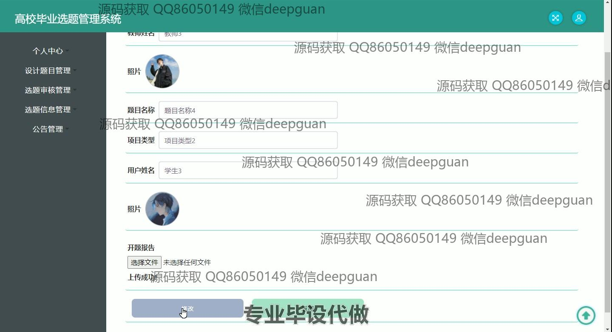
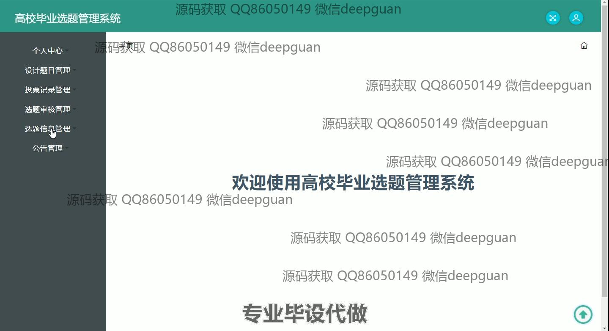

<h1 align="center">高校毕业选题管理系统的设计与实现</h1>

## 简介
高校毕业选题管理系统，角色分为管理员和用户，功能包括个人中心管理、设计题目管理、选题审核、投票记录管理，以及公告管理，便于高校进行毕业设计选题的管理和审核流程。    --计算机毕业设计源码；毕设源码；java毕业设计源码

## 联系方式

<h3 align="center">获取完整代码与数据库文件 + 微信：deepguan QQ: 86050149 QQ群: 783742310</h3>

<h3 align="center">可帮忙远程部署 包运行成功！提供远程部署、修改代码、设计文档指导、代码讲解等服务！</h3>

## 功能介绍（完整见运行截图）
管理员：管理员可以管理用户和教师信息，包括添加、修改和删除用户和教师资料，并核查用户基本信息。具备登录、注册、角色分配和权限管理功能，以确保系统运行及数据安全。管理员还负责毕业选题的设计管理、审核状态的管理和查看选题详情，能够发布和管理公告以及进行基础数据管理。

教师：教师拥有上传和编辑设计题目的权限，可以修改及更新个人信息和教学选题，参与投票记录和查看投票结果。教师可查看所发布题目的审核状态及编辑题目的信息。教师还能够查看、提交及通过选题审核，并更新需要上传的开题报告和论文等相关文件。

用户：用户拥有个性信息的注册、登录、编辑及修改等基本功能，能够浏览和检索各类选题信息，并可以进行选题申请。用户可以查看、下载开题报告及中期报告，参与题目投票、查看选题审核结果，还能提交必要的报告供教师和管理员审核。用户的个人信息管理包括更改密码等功能。

## 运行截图

本代码来源于网络,仅供学习参考使用!

